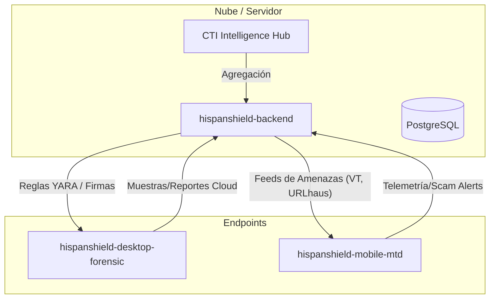

# 🛡️ HubSecurityArtificialIntelligence: El Ecosistema HispanShield

Bienvenido al **Hub de Ciberseguridad y Ciberinteligencia** personal de **Gustavo Lobato (MuRDoK)**. Este repositorio centraliza una suite avanzada de herramientas de defensa, análisis y respuesta ante amenazas, integrando backend cloud, agentes de escritorio y soluciones móviles.

## 🌌 Visión General

HispanShield no es solo un conjunto de herramientas; es un ecosistema simbiótico donde cada componente se alimenta de una inteligencia común para proteger infraestructuras críticas y dispositivos personales.

## 🏗️ Los Componentes del Hub

### 1. 🧠 [hispanshield-backend](./hispanshield-backend)
El "cerebro" central del ecosistema. Construido con **FastAPI** y orientado a una arquitectura multi-tenant.
- **Funciones**: Gestión de inteligencia de amenazas (CTI), orquestación de sandboxes y almacenamiento centralizado de eventos.
- **Tecnologías**: Python 3.11+, PostgreSQL, Celery, Docker.

### 2. 🔍 [hispanshield-desktop-forensic](./hispanshield-desktop-forensic)
Herramienta de análisis forense y respuesta (EDR) para sistemas de escritorio.
- **Funciones**: Análisis estático de binarios, escaneo con motores YARA personalizados y generación de reportes técnicos.
- **Tecnologías**: PySide6 (Qt), Python, SQLite.

### 3. 📱 [hispanshield-mobile-mtd](./hispanshield-mobile-mtd)
Solución de **Mobile Threat Defense (MTD)** diseñada para la protección proactiva en smartphones.
- **Funciones**: Detección de phishing por SMS, bloqueo de llamadas scam y análisis de integridad del dispositivo.
- **Tecnologías**: Flutter, Dart.

## 🚀 Cómo Empezar

Para desplegar el ecosistema completo, se recomienda comenzar por el backend:

1. Revisa los requisitos previos en cada directorio.
2. Configura las variables de entorno (`.env`) siguiendo los ejemplos proporcionados.
3. Utiliza Docker Compose en el backend para levantar la infraestructura core.

---
**Firmado,**
**MuRDoK (Gustavo Lobato)**
*Hub de Inteligencia y Defensa Artificial.*
