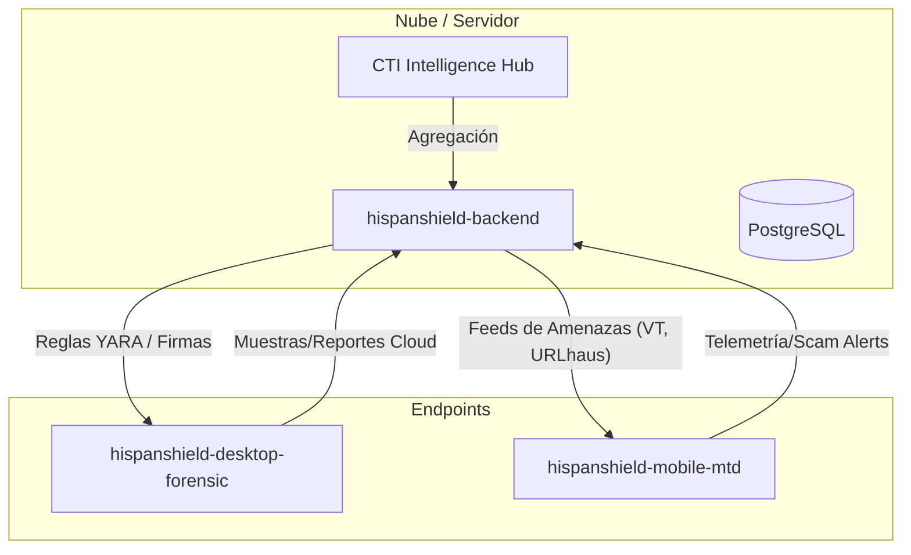

# 🛡️ HubSecurityArtificialIntelligence: El Ecosistema HispanShield

Bienvenido al **Hub de Ciberseguridad y Ciberinteligencia** personal de **Gustavo Lobato (MuRDoK)**. Este repositorio centraliza una suite avanzada de herramientas de defensa, análisis y respuesta ante amenazas, integrando backend cloud, agentes de escritorio y soluciones móviles.

## 🌌 Visión General

HispanShield no es solo un conjunto de herramientas; es un ecosistema simbiótico donde cada componente se alimenta de una inteligencia común para proteger infraestructuras críticas y dispositivos personales.

```mermaid
graph TD
    subgraph "Nube / Servidor"
        B[hispanshield-backend]
        DB[(PostgreSQL)]
        CTI[CTI Intelligence Hub]
    end

    subgraph "Endpoints"
        D[hispanshield-desktop-forensic]
        M[hispanshield-mobile-mtd]
    end

    M -- Telemetría/Scam Alerts --> B
    D -- Muestras/Reportes Cloud --> B
    B -- Feeds de Amenazas (VT, URLhaus) --> M
    B -- Reglas YARA / Firmas --> D
    CTI -- Agregación --> B
```

## 🏗️ Los Componentes del Hub

### 1. 🧠 [hispanshield-backend](./hispanshield-backend)
El "cerebro" central del ecosistema. Construido con **FastAPI** y orientado a una arquitectura multi-tenant.
- **Funciones**: Gestión de inteligencia de amenazas (CTI), orquestación de sandboxes y almacenamiento centralizado de eventos.
- **Tecnologías**: Python 3.11+, PostgreSQL, Celery, Docker.

### 2. 🔍 [hispanshield-desktop-forensic](./hispanshield-desktop-forensic)
Herramienta de análisis forense y respuesta (EDR) para sistemas de escritorio.
- **Funciones**: Análisis estático de binarios, escaneo con motores YARA personalizados y generación de reportes técnicos.
- **Tecnologías**: PySide6 (Qt), Python, SQLite.

### 3. 📱 [hispanshield-mobile-mtd](./hispanshield-mobile-mtd)
Solución de **Mobile Threat Defense (MTD)** diseñada para la protección proactiva en smartphones.
- **Funciones**: Detección de phishing por SMS, bloqueo de llamadas scam y análisis de integridad del dispositivo.
- **Tecnologías**: Flutter, Dart.

## 🚀 Cómo Empezar

Para desplegar el ecosistema completo, se recomienda comenzar por el backend:

1. Revisa los requisitos previos en cada directorio.
2. Configura las variables de entorno (`.env`) siguiendo los ejemplos proporcionados.
3. Utiliza Docker Compose en el backend para levantar la infraestructura core.

---
**Firmado,**
**MuRDoK (Gustavo Lobato)**
*Hub de Inteligencia y Defensa Artificial.*

---

## 🎖️ CENTRO DE COMUNICACIONES Y REPORTES OFICIALES
**NIVEL DE ACCESO:** AUTORIZADO | **DESTINATARIO:** COMANDANCIA DE DESARROLLO (gustavolobatoclara@gmail.com)

A través del siguiente portal de comunicaciones, el personal autorizado puede emitir reportes de incidencias, fallas críticas en despliegue (compilación) o solicitudes de mejoras estratégicas. Seleccione la directiva correspondiente para visualizar los protocolos de envío:

<b>🚨 REPORTAR QUEJA O INCIDENCIA DISCIPLINARIA / OPERATIVA</b>

 
Para tramitar una queja sobre el funcionamiento, estructura o contenido del sistema, envíe un mensaje a <b>gustavolobatoclara@gmail.com</b> siguiendo este protocolo:
<ol>
  <li><b>Asunto:</b> [QUEJA] - Nombre del Sistema - Breve descripción.</li>
  <li><b>Cuerpo del mensaje:</b> Detallar claramente la incidencia, impacto operativo y, si es posible, la evidencia (capturas o logs).</li>
  <li><b>Prioridad:</b> Indicar si es de atención inmediata o diferida.</li>
</ol>

<b>🛠️ REPORTE DE PROBLEMAS DE COMPILACIÓN O DESPLIEGUE</b>

 
Si experimenta fallos durante la fase de compilación o instalación del sistema, reporte a <b>gustavolobatoclara@gmail.com</b> con la siguiente estructura técnica:
<ol>
  <li><b>Asunto:</b> [COMPILACIÓN] - Falla en entorno &lt;Entorno/OS&gt;.</li>
  <li><b>Especificaciones:</b> Sistema Operativo, versión de dependencias y herramientas de compilación utilizadas.</li>
  <li><b>Traza de Error (Logs):</b> Adjunte el log completo de errores proporcionado por la terminal (en formato texto o captura legible).</li>
  <li><b>Pasos de Reproducción:</b> Secuencia exacta de comandos ejecutados antes del fallo crítico.</li>
</ol>

<b>💡 SUGERENCIAS O SOLICITUDES DE DESARROLLO</b>

 
Para proponer nuevas capacidades tácticas, módulos de inteligencia o mejoras de arquitectura, envíe su solicitud a <b>gustavolobatoclara@gmail.com</b>:
<ol>
  <li><b>Asunto:</b> [PROPUESTA] - Mejora o Nuevo Módulo.</li>
  <li><b>Objetivo Táctico:</b> ¿Qué problema resuelve o qué ventaja proporciona esta nueva característica?</li>
  <li><b>Viabilidad:</b> (Opcional) Posible enfoque técnico o herramientas recomendadas para su implementación.</li>
</ol>

---
